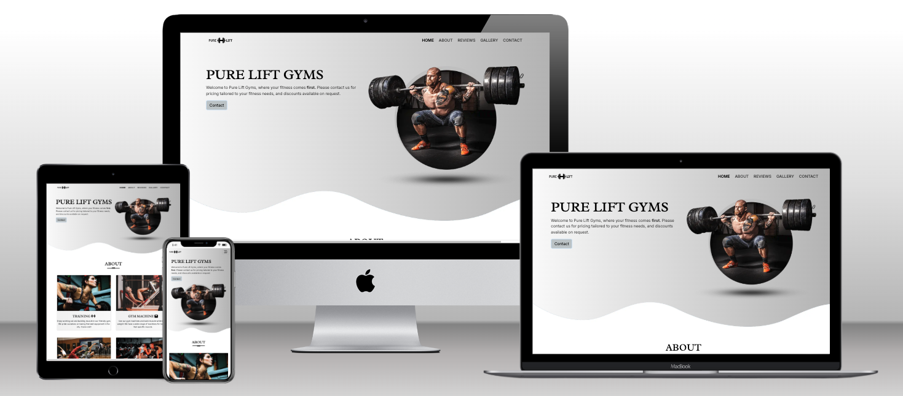

# Pure Lift Gyms

[View live project here.](https://p-g1977.github.io/Pure-Lift-Gyms/)

This is an experimental site for a fictional company called Pure Fit Gyms, completed for my Milestone 1 project in L5 Web Application Development. The site is designed to be responsive on a range of devices and easy to navigate. I wanted to make the site simple and interesting to hopefully capture the users view and keep them engaged.

Users of the website are able to find information about the gym, reviews from people who have used the gym, and an easy way to find / contact the gym for more information. There is also a Gallery page to show more information about what is available at the gym.

---

---
## User Experience

* ### User Stories

    * First Time Visitor Goals

        1. As a First Time Visitor, I want to understand the main purpose of the site and learn about the company with high quality images and engaging descriptions.
        2. As a First Time Visitor, I'd like a user-friendly design so I can find information about the company quickly and easily.
        3. As a First Time Visitor, I want to look for reviews of the company to understand what previous clients think.
        4. As a First Time Visitor, I'd like to see information that shows me the benefits of using the company. 

    * Returning Visitor Goals

        1. As a Returning Visitor, I want to be able to contact the company for information about prices and discounts.
        2. As a Returning Visitor, I want to find the company easily.
        3. As a Returning Visitor, I want to find social media links for the company so I can see information about their followings and comments from people who have used the company.

    * Frequent Visitor Goals

        1. As a Frequent User, I want a company newletter emailed to me so I can see any changes, events, and updates about the company.

---

## Design

* ### Color Scheme

| Main Colors   | Typorgraphy   |
| ------------- |:-------------:|
| Black         | Black         |
| White         |               |
| #f9f9f9       |               |
| #b4b4b4       |               |

* ### Typography

#### Radley Font

Radley font from [Google Fonts](https://fonts.google.com/) is used on the main heading and subheadings of the site, with a fallback of the Serif font in case the font isn't being imported correctly. Radley is the font I thought looked strong and relevant for a gym website.

#### Inter Font

 

 Inter font from [Google Fonts](https://fonts.google.com/) is used in the body of the website, with a fallback of the Serif font. Inter font is clear and simple which I thought worked well for descriptions and captions that are easy to read.

* ### Imagery

    * The background hero image is designed to catch the user's attention and to quickly describe the purpose of the business to the visitor. The image looks like it is breaking through the landing page and has an energetic aesthetic.

* ### Wireframes

    * Home Page Desktop Wireframe - [Link Here](assets/docs/wireframe/desktop-wire.png)

    * Home Page Tablet Wireframe - [Link Here](assets/docs/wireframe/tablet-wire.png)

    * Home Page Mobile Wireframe - [Link Here](assets/docs/wireframe/mobile-wire.png)

    * Gallery Page Desktop Wireframe - [Link Here](assets/docs/wireframe/desktop-gall-wire.png)

    * Gallery Page Tablet Wireframe - [Link Here](assets/docs/wireframe/tablet-gall-wire.png)

    * Gallery Page Mobile Wireframe - [Link Here](assets/docs/wireframe/mobile-gall-wire.png)

The Wireframes have the full Navigation Bar on the Desktop and Tablet and a collapsed NavBar on the Mobile Wireframe. The Social Media Icons are on all Wireframes and shrink nicely on all screen sizes. The NavBar is bold and easy to read so I thought it would not be necessary for it to be the collapsed version on Tablet devices.

## Features

* Responsive on all device sizes.

* Navigation Bar.

    * Sitting at the top of all three pages. The navigation links are situated to the right of the page.

    * On larger screen the navigation links show text; Home, About, Reviews, Gallery and Contact. The navigation bar collapses on smaller screens just below 768px, and the links are situated in the burger icon that expands when you click it with the links showing accross the right of the screen.

* The Header.

    * There is a Company Logo at the top left of the header section, that will take the user to the home page when it is clicked.

    * The Company Logo and Header section set the main color theme; white, black and a linear gradiant grey.
    

* Favicon.

    * Originally I tried to make a logo for the company into a Favicon. After trying differnt ideas I decided a more effective Favicon would be a simple dumbbell next to the page name.
    
        

* An About section with images of the company and Fontawesome Icons.

    * This section contains information on why the user should consider using the company.

    * The section has a Contact button underneath the text, so it is easy for the user to contact the company at this stage.

        

* Reviews from previous clients.

    * The reviews section is situated below the about section on the home page and consists of two reviews from a male and a female. 
    

    * On smaller screens the reviews sit on top of each other, female first and male review sitting below.

* An interactive map showing the exact location of the company and a Contact form.

    * This section originally had an interactive Iframe map element, which I changed to an image. More informtion on the reasons for this change can be found in the 'issues' section.

    * There is a Contact form next to the map that makes it easy to contact the company for more information. The map and form are fully responsive and sit on top of each other on Mobile screens.

        

* Links to social media accounts.

    * The links to the Social Media are situated just above the Footer. Using the translate(Y) CSS function the icons reposition vertically 10 pixels, which creates a pleasant effect when hovered over.

        

* The Footer with an option to subscribe to the company newsletter.

    * The Footer contains the Company Logo and ways to contact the conpany by email or phone. Fontawesome icons are added so there are more visual cues to catch the users eye.

    * There is an option to subscribe to the company newsletter in this section. The subscribe option is bold and easy for the user to interact with.

        

* A Gallery section with more images and infomation about the company.

## Technologies Used

### Languages Used

* [HTML5](https://en.wikipedia.org/wiki/HTML5)

* [CSS3](https://en.wikipedia.org/wiki/CSS#CSS_3)

### Frameworks, Libraries & Programs Used

1. [Bootstrap v5.3](https://getbootstrap.com/docs/5.3/getting-started/introduction/)
    
    * Boostrap was used to assist with the responsiveness and styling of the website.