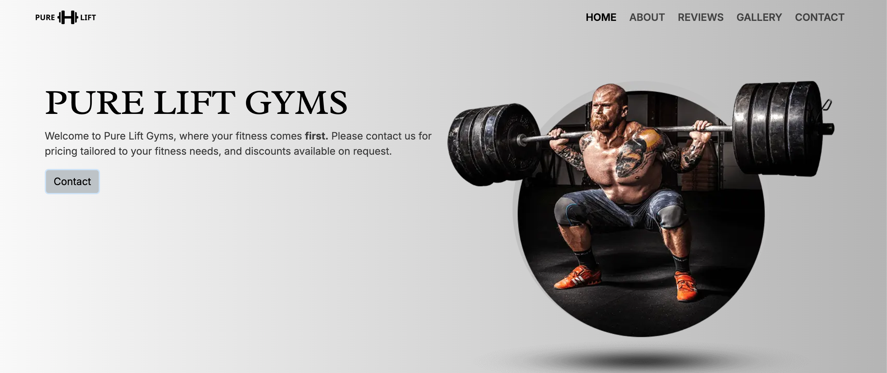
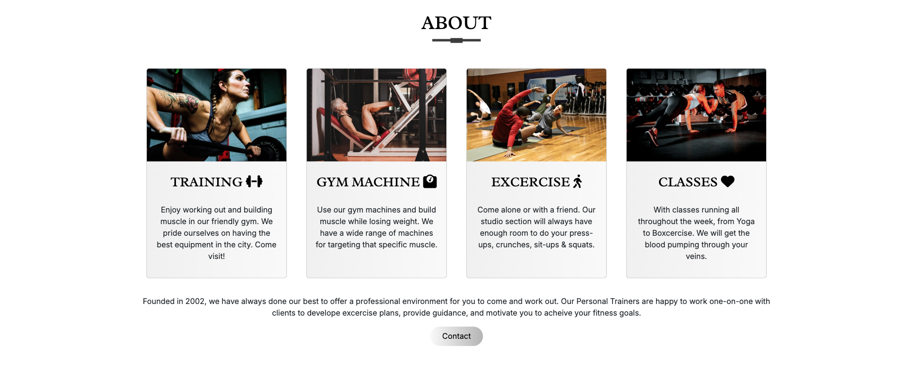
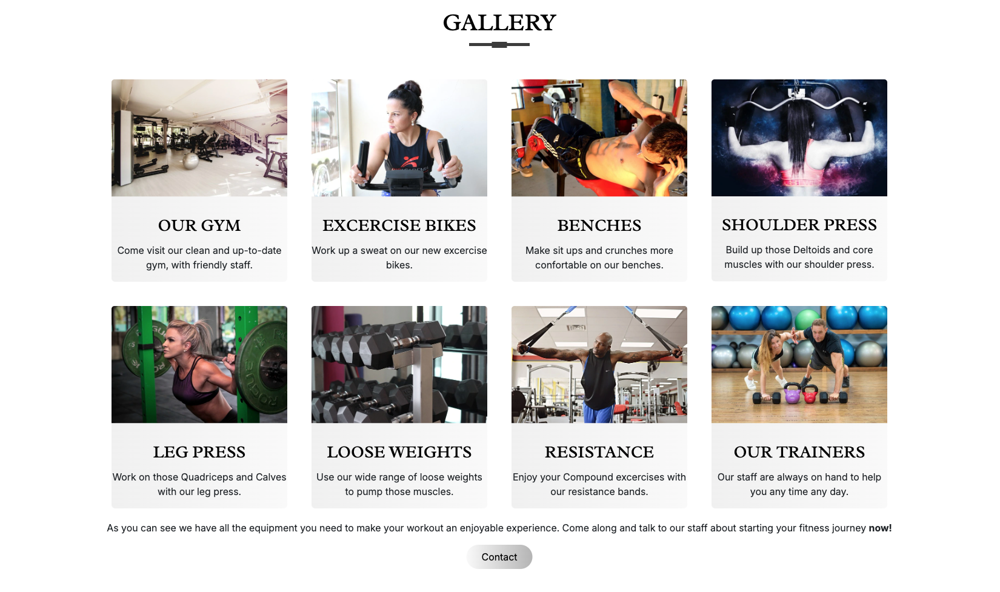
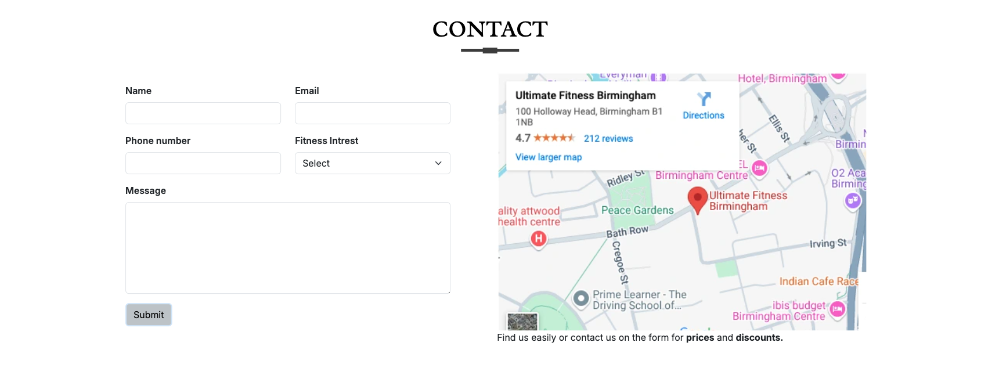
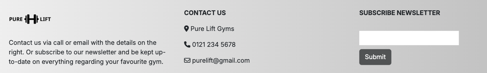

# Pure Lift Gyms

[View live project here.](https://p-g1977.github.io/Pure-Lift-Gyms/)

This is an experimental site for a fictional company called Pure Fit Gyms, completed for my Milestone 1 project in L5 Web Application Development. The site is designed to be responsive on a range of devices and easy to navigate. I wanted to make the site simple and interesting to hopefully capture the users view and keep them engaged.

Users of the website are able to find information about the gym, reviews from people who have used the gym, and an easy way to find / contact the gym for more information. There is also a Gallery page to show more information about what is available at the gym.

---

---
## User Experience

* ### User Stories

    * First Time Visitor Goals

        1. As a First Time Visitor, I want to understand the main purpose of the site and learn about the company with high quality images and engaging descriptions.
        2. As a First Time Visitor, I'd like a user-friendly design so I can find information about the company quickly and easily.
        3. As a First Time Visitor, I want to look for reviews of the company to understand what previous clients think.
        4. As a First Time Visitor, I'd like to see information that shows me the benefits of using the company. 

    * Returning Visitor Goals

        1. As a Returning Visitor, I want to be able to contact the company for information about prices and discounts.
        2. As a Returning Visitor, I want to find the company easily.
        3. As a Returning Visitor, I want to find social media links for the company so I can see information about their followings and comments from people who have used the company.

    * Frequent Visitor Goals

        1. As a Frequent User, I want a company newletter emailed to me so I can see any changes, events, and updates about the company.

---

## Design

* ### Color Scheme

| Main Colors   | Typorgraphy   |
| ------------- |:-------------:|
| Black         | Black         |
| White         |               |
| #f9f9f9       |               |
| #b4b4b4       |               |

* ### Typography

#### Radley Font

Radley font from [Google Fonts](https://fonts.google.com/) is used on the main heading and subheadings of the site, with a fallback of the Serif font in case the font isn't being imported correctly. Radley is the font I thought looked strong and relevant for a gym website.

#### Inter Font

 

 Inter font from [Google Fonts](https://fonts.google.com/) is used in the body of the website, with a fallback of the Serif font. Inter font is clear and simple which I thought worked well for descriptions and captions that are easy to read.

* ### Imagery

    * The background hero image is designed to catch the user's attention and to quickly describe the purpose of the business to the visitor. The image looks like it is breaking through the landing page and has an energetic aesthetic.

* ### Wireframes

    * Home Page Desktop Wireframe - [Link Here](assets/docs/wireframe/desktop-wire.png)

    * Home Page Tablet Wireframe - [Link Here](assets/docs/wireframe/tablet-wire.png)

    * Home Page Mobile Wireframe - [Link Here](assets/docs/wireframe/mobile-wire.png)

    * Gallery Page Desktop Wireframe - [Link Here](assets/docs/wireframe/desktop-gall-wire.png)

    * Gallery Page Tablet Wireframe - [Link Here](assets/docs/wireframe/tablet-gall-wire.png)

    * Gallery Page Mobile Wireframe - [Link Here](assets/docs/wireframe/mobile-gall-wire.png)

The Wireframes have the full Navigation Bar on the Desktop and Tablet and a collapsed NavBar on the Mobile Wireframe. The Social Media Icons are on all Wireframes and shrink nicely on all screen sizes. The NavBar is bold and easy to read so I thought it would not be necessary for it to be the collapsed version on Tablet devices.

## Features

* Responsive on all device sizes.

* Waves breaking up sections. I made this website to have sections which are mostly on one page, however I did not want harsh breaks in colors splitting the sections. So I created wave images that align at the bottom of each section. This creates a pleasing aesthetic.

    

* Navigation Bar.

    * Sitting at the top of all three pages. The navigation links are situated to the right of the page.

    * On larger screen the navigation links show text; Home, About, Reviews, Gallery and Contact. The navigation bar collapses on smaller screens just below 768px, and the links are situated in the burger icon that expands when you click it with the links showing accross the right of the screen.

* The Header.

    * There is a Company Logo at the top left of the header section, that will take the user to the home page when it is clicked.

    * The Company Logo and Header section set the main color theme; white, black and a linear gradiant grey.
    

* Favicon.

    * Originally I tried to make a logo for the company into a Favicon. After trying differnt ideas I decided a more effective Favicon would be a simple dumbbell next to the page name.
    
        

* An About section with images of the company and Fontawesome Icons.

    * This section contains information on why the user should consider using the company.

    * The section has a Contact button underneath the text, so it is easy for the user to contact the company at this stage.

        

* Reviews from previous clients.

    * The reviews section is situated below the about section on the home page and consists of two reviews from a male and a female. 
    

    * On smaller screens the reviews sit on top of each other, female first and male review sitting below.

* An interactive map showing the exact location of the company and a Contact form.

    * This section originally had an interactive Iframe map element, which I changed to an image. More informtion on the reasons for this change can be found in the 'issues' section.

    * There is a Contact form next to the map that makes it easy to contact the company for more information. The map and form are fully responsive and sit on top of each other on Mobile screens.

        

* Links to social media accounts.

    * The links to the Social Media are situated just above the Footer. Using the translate(Y) CSS function the icons reposition vertically 10 pixels, which creates a pleasant effect when hovered over.

        

* The Footer with an option to subscribe to the company newsletter.

    * The Footer contains the Company Logo and ways to contact the conpany by email or phone. Fontawesome icons are added so there are more visual cues to catch the users eye.

    * There is an option to subscribe to the company newsletter in this section. The subscribe option is bold and easy for the user to interact with.

        

* A Gallery section with more images and infomation about the company.

    * The Gallery section is on a seperate page to the home page and shows more information about the company with images and descriptions. 

    * This section shows an image of the company and images of the trainers and equipment that users can expect at the company. There is a contact button just underneath this section that will take the user to the contact form on the home page when clicked.

        

### Features Left To Implement

* I would like to create a webshop so users can easily enroll and use services. The webshop will contain all the different packages to choose when it comes to using the company. Gym membership and classes would be used mainly in the webshop, and also day passes and student passes with valid student ID. 

## Technologies Used

### Languages Used

* [HTML5](https://en.wikipedia.org/wiki/HTML5)

* [CSS3](https://en.wikipedia.org/wiki/CSS#CSS_3)

### Frameworks, Libraries & Programs Used

1. [Bootstrap v5.3](https://getbootstrap.com/docs/5.3/getting-started/introduction/)
    
    * Boostrap was used to assist with the responsiveness and styling of the website.

2. [Hover.css](https://ianlunn.github.io/Hover/)

    * Hover.css was used on the Social Media Icons in the Social Media setion to add the float transition while being hovered over.

3. [Google Fonts](https://fonts.google.com/)

    * Google fonts were used to import the 'Radley' and 'Inter' fonts into the style.css file which is used on all the pages throughout the project.

4. [Font Awesome](https://fontawesome.com/)

    * Font Awesome was used on all pages throughout the webite to add icons for aesthetic and UX purposes.

5. [jQuery](https://jquery.com/)

    * jQuery came with Bootstrap to make the navbar responsive and was also used for the smooth scroll function in JaveScript.

6. [Git](https://git-scm.com/)

    * Git was used for the version control by utilizing the Gitpod terminal to commit to Git and Push to GitHub.

7. [GitHub](https://github.com/)

    * GitHub is used to store the projects code after being pushed to GitHub.

8. [Gimp](https://www.gimp.org/about/)

    * The GNU Image Manipulation Program, commonly known as GIMP, is a free and open-source rastor graphics editor which was used to create the logo, waves, resizing images and editing photos for the website.

9. [Balsamiq](https://balsamiq.com/)

    * Balsamiq was used to create the [wireframes](assets/docs/wireframe/) during the design process.

10. [Favicon](https://favicon.io/)

    * [Favicon generator](https://favicon.io/favicon-generator/) was used to create the Favicon for the website.

## Testing

### Testing User Stories from User Experience (UX) Section

* First Time Visitor Goals

1. As a First Time Visitor, I want to understand the main purpose of the site and learn about the company with high quality images and engaging descriptions.
    
    i. When the First Time Visitor enters the site, they are greeted with a clean and easily readable navigation bar where they can go to the page of their choice. Underneath the navigation bar there is a Hero Image with the company name that's bold and catches the users eye.

    ii. There is a brief welcome statement underneath the Company Logo that describes the nature of the site, and a call to action button "Contact".

    iii. The main points are made immediately with the description and the hero image.

    iiii. The First Time Visitor now has two options, click the call to action button to contact the Company straight away, or scroll down the page to find more information.

    

2. As a First Time Visitor, I'd like a user-friendly design so I can find information about the company quickly and easily.

    i. At the top of the page there is a clean navigation bar, all describe what page the First Time Visitor will end up at clearly and easily.

    ii. On the "About" page the First Time Visitor can find more in-depth information about the Company, with high quality images showing the clients using the equipment and images of the type of services offered. Underneath the images are clear and easily readable descriptions detailing the services offered with [Font Awesome](https://fontawesome.com/) icons helping to catch the users eye, and provide a more professional look and feel.

    iii. Underneath the images and descriptions in the About section there is more information describing the Company, when it was founded, and services available to the First Time Visitor.

    iiii. There is also a Contact button underneath the description so the First Time Visitor can choose to contact the company from this section too.

    

3. As a First Time Visitor, I want to look for reviews of the company to understand what previous clients think.

    i. Once the First Time Visitor has looked through the About section and understood exactly what the Company offers, they will be able to see the reviews from previous clients.

    ii. The section is designed to look professional and grab the First Time Visitor's attention, so new users can see a brief review and photo that describes previous clients thoughts about the Company. A name has been added for a more personal feel.

 4. As a First Time Visitor, I'd like to see information that shows me the benefits of using the company.

    i. In the Gallery section the First Time Visitor can see more detailed images of the Company, the equipment and Personal Trainers.

    ii. This section provides the benefit of using the Company by showing the wide range of services and eqiupment offered, with brief descriptions providing information why these can be of benefit to the First Time Visitor.

    

* Returning Visitor Goals

1. As a Returning Visitor, I want to be able to contact the company for information about prices and discounts.

    i. The Returning Visitor can contact the company via the form on the contact page.

2. As a Returning Visitor, I want to find the company easily.

    i. The Returning Visitor can find the company easily via the interactive map on the contact page.

    

3. As a Returning Visitor, I want to find social media links for the company so I can see information about their followings and comments from people who have used the company.

    i. The social media section is just above the Footer of the page and has links to Facebook, Instagram, Twitter (x), and Snapchat. Each link opens in a new tab and more information about the Company can be found on each Social Media page.

* Frequent Visitor Goals

1. As a Frequent User, I want a company newletter emailed to me so I can see any changes, events, and updates about the company.

    i. Frequent Visitors can subscribe to receive a newsletter by inputting their email address in the form provided on the right hand side of the Footer. 

    ii. The telephone number and email address are provided in the Footer so Frequent Visitors can contact via these if they prefer. A telephone number and Company email address can help to provide a more trustworthy image.

    

## Further Testing

* Accesibility

    * I ran the website through Lighthouse in Chrome Devtools to confirm that the colors and fonts are easy to read and the site is accessible.

    

    * Used semantic HTML elements.

    * I have made sure the colors contrast well together to keep the elements easily identifiable and readable.

    * The website has been tested and works fully on browsers; Chrome, Safari, Firefox, Brave and Microsoft Edge.

    * I have tested the website on Iphone 12, Iphone SE, Samsung Galaxy Flip 2 and Samsung Galaxy S24.

    * All external links for the Social Media icons open in a seperate tab.

    * All internal links work and redirect the user between the pages.

    * The Contact Form works and has the autocomplete setting on, all fields are required, the form select option displays select, the email field only accepts an email address and the submit button link works and directs to the success page.

        

* HTML

    * No errors found when running the HTML code through [W3C HTML Validator](https://validator.w3.org/nu/?doc=https%3A%2F%2Fp-g1977.github.io%2FPure-Lift-Gyms%2F)
    

* CSS

    * No errors found when running the CSS code through [W3C CSS Validator](https://jigsaw.w3.org/css-validator/validator?uri=https%3A%2F%2Fp-g1977.github.io%2FPure-Lift-Gyms%2F&profile=css3svg&usermedium=all&warning=1&vextwarning=&lang=en)
    

## Bugs / Issues

* I originally used and Iframe embed for Google Maps next to the Contact form which was interactive and opened in Google maps when choosing fullscreen. Unfortunately this dropped my best practices score in Lighthouse to 79. I reviewed as much information from the web that I could to try and make this work without creating 5 Cookies, but after consultation with my tutor he advised the best idea would be to use an image of the map instead.

* The waves that break up the sections created many problems at the start of the project. Upon reaching 400 pixels in devtools they broke out of their sections and there were visible gaps showing. I solved this problem by creating many Media Queries that move the wave images into the correct positions when the screen is shrunk up until 300 pixels wide.

### Unfixed bugs

* No unfixed bugs.

## Deployment

### Version Control

* This site was created using Gitpod editor and pushed to Github to the remote repository 'Pure-Lift-Gyms'.
* Git commands were used throughout the development to push the code to the remote repository. The following Git commands were used.
    * git add . | To add the files to the staging area before being commited.
    * git commit -m "commit message" | To commit changes to the local repository queue.
    * git push | To push all commited code to the remote repository on Github

### Deployment to Github

* I deployed this site to Github as follows.
    * In the Github repository navigate to the Settings tab.
    * At the source section drop-down menu, select the Master branch and save
    * When the Maste branch is selected, the page will provide a link to the website.
* The live link is: [Pure Lift Gyms](https://p-g1977.github.io/Pure-Lift-Gyms/)

### Forking the Github Repository

* Log into GitHub and locate [Pure Lift Gyms](https://github.com/P-G1977/Pure-Lift-Gyms)
* At the top of the repository (not top of page) just above the 'Settings' Button on the menu, locate the 'Fork' Button.
* You should now have a copy of the original repository in your GitHub account. However this WILL NOT affect the original repository but will just make a copy.

### Making a Local Clone

1. Log in to GitHub and locate [P-G1977/Pure-Lift-Gyms](https://github.com/P-G1977/Pure-Lift-Gyms)
2. Under the repository name, click 'Clone or download'.
    * To download the Zip file click the 'Download Zip' at the bottom of the dropdown menu.
3. To clone the repository using HTTPS, under 'Clone with HTTPS', copy the link.
4. Open Git Bash.
5. Change the current working directory to the location where you want the cloned directory to be made.
6. Type `git clone`, and then paste the URL you copied in Step 3.
    
     `$ git clone https://github.com/P-G1977/Pure-Lift-Gyms.git`

7. Press Enter. Your local clone will be created.

## Credits

### Images

* All gym images were used from [pixabay](https://pixabay.com/images/search/gym/) which provides royalty-free images.

* The dumbell Favicon was created using an image from [emojis.sh](https://emojis.sh/).

* The hero image was used from [cleanpng](https://www.cleanpng.com/) who also provides royalty-free images.

* The male and female image in the reviews section are also used from Pixabay and here are the links: [Male](https://pixabay.com/photos/portrait-people-adult-man-face-3353699/), [Female](https://pixabay.com/photos/woman-portrait-model-smile-smiling-657753/).

### Design Help

* The original wave section idea came from this post; [How to create a wave for background using HTML & CSS](https://www.geeksforgeeks.org/how-to-create-a-wave-image-for-a-background-using-html-and-css/). However after trying to use this I decided creating a wave in [GIMP](https://www.gimp.org/about/) and using it as an image and placing at the top / bottom of each section would work too.

* The above post also helped me research more about [::before](https://www.geeksforgeeks.org/css-before-selector/) and [::after](https://www.geeksforgeeks.org/css-after-selector/) that I used for the underlining of the subtitles in my project.

* The following post helped with the idea of using a [banner](https://www.quora.com/How-can-I-make-a-banner-in-HTML-using-the-div-tag) at the top of my page.

### Code help

* While researching how I'd create this site I studied many ideas used from [Stackoverflow](https://stackoverflow.com/) and [developer.mozilla](https://developer.mozilla.org/en-US/).

    * [Linear gradient CSS code idea](https://developer.mozilla.org/en-US/docs/Web/CSS/gradient/linear-gradient).

    * [translate(Y) CSS code idea](https://stackoverflow.com/questions/15317020/css3-translate-out-of-screen).

    * [responsive map CSS code idea](https://stackoverflow.com/questions/15421369/responsive-google-map).

* The majority of knowledge on how to create this first website has been thanks to [The Code Institute](https://codeinstitute.net/).

### Support

* A special thanks to my mentor Spencer Barriball for all the support and help he has given through this project. I'm lucky to have such a great mentor! 

